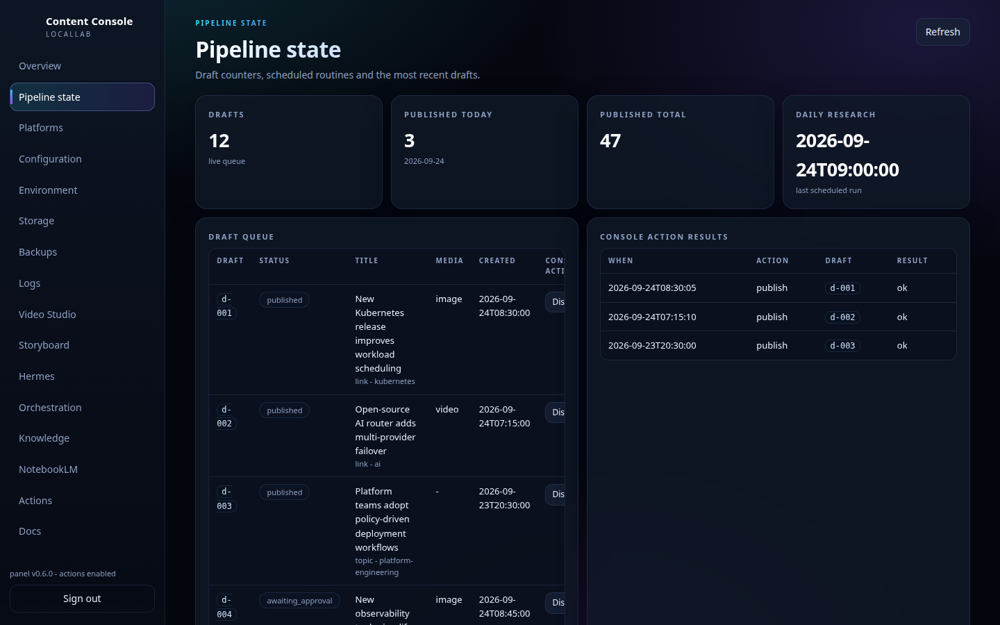
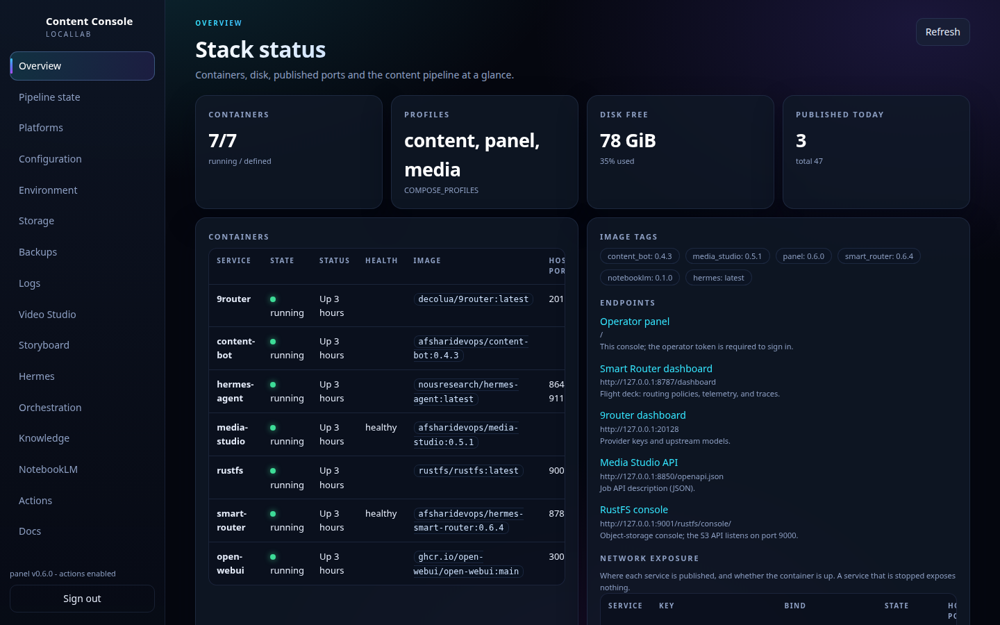
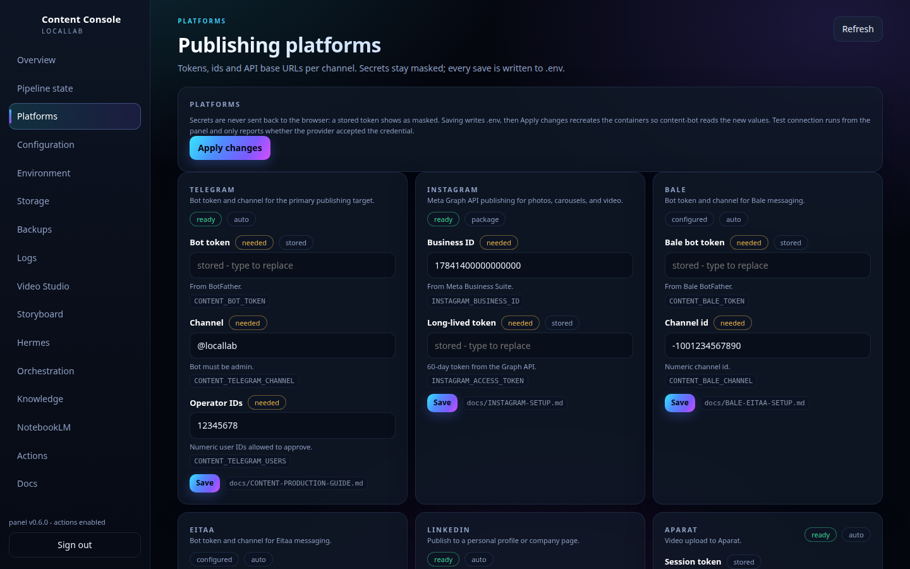
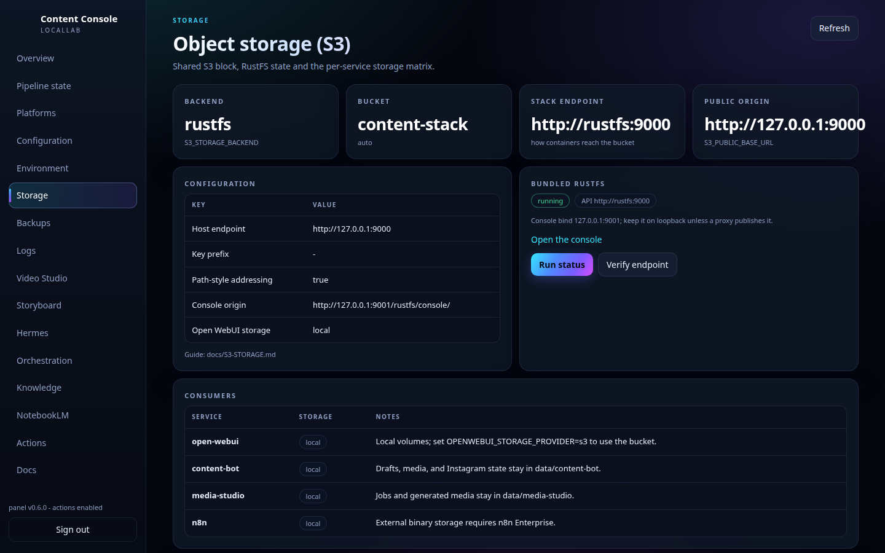
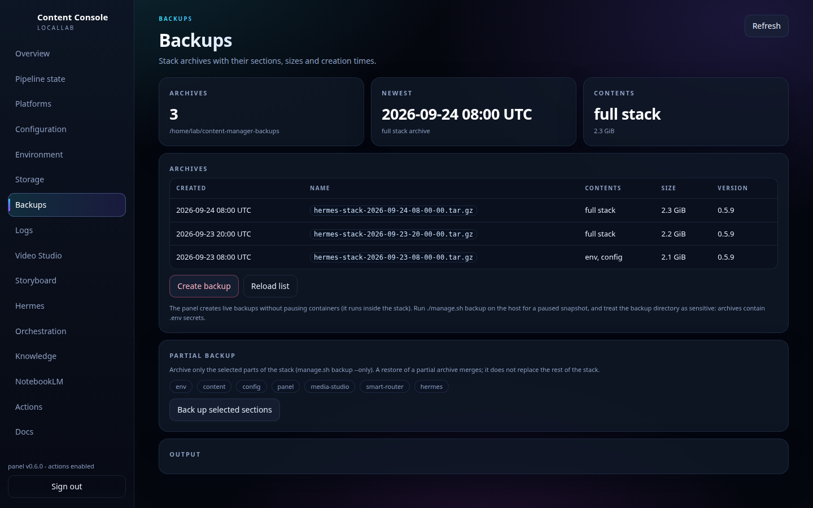
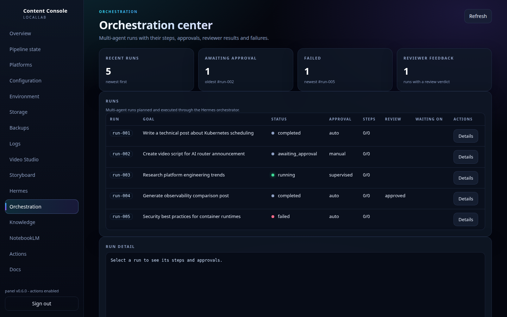

# Content Manager

### Self-hosted AI Content Operations Platform

[](https://github.com/Afsharidevops/content-manager/actions/workflows/validate.yml)
[](https://github.com/Afsharidevops/content-manager/releases/latest)
[](https://hub.docker.com/r/afsharidevops/content-bot)
[](LICENSE)

**Discover → Score → Draft → Approve → Publish**

**Self-hosted AI Content Operations, with humans in control.**

Content Manager is a self-hosted, human-in-the-loop platform for automating the
full content operations loop. It discovers stories from RSS feeds, shared links,
and operator topics; evaluates them against an editable editorial policy;
generates AI-assisted drafts and media; waits for human approval; and then
publishes to the configured platforms.

It extends the Hermes Linux Stack with Content Bot, Smart Router, multi-agent
orchestration, Media Studio, NotebookLM workflows, object storage, and
reproducible deployment paths for Docker Compose and Helm.

**Publishing:** Telegram · Instagram · Bale · Eitaa · LinkedIn · Aparat  
**AI:** OpenAI-compatible providers · Smart Router · 9router · OmniRoute  
**Media:** Image generation · Video generation · Timeline rendering · NotebookLM  
**Deploy:** Docker Compose · Helm · Kubernetes

Default image tags are defined in `.env.example` and can be pinned per service.
The Content Manager release, Smart Router image, Content Bot, Media Studio,
NotebookLM Worker, and Content Operations Center versions move independently.

## Why Content Manager?

Most AI content tools stop at generation. Content Manager covers the operational
loop around generation: discovery from feeds, links, and topics; editorial
policy and scoring; AI-assisted drafting; media production; human approval; and
publishing to configured channels.

It is designed to be self-hosted, provider-agnostic, approval-gated, and
operationally reproducible: the same repository contains the bot, content
policy, router integration, media workers, Content Operations Center, Docker
Compose stack, and Helm chart.



## Quick start

Requirements:

- Linux, Bash, Docker Engine with the Compose plugin, Git
- Outbound HTTPS to Docker Hub and the Telegram Bot API
- A Telegram bot token, your numeric Telegram user ID, and a Telegram channel
- At least one AI provider configured in 9router or OmniRoute

```bash
git clone https://github.com/Afsharidevops/content-manager.git
cd content-manager
chmod +x install.sh manage.sh
./install.sh
```

The installer asks which router backend to use, prompts for Content Bot
settings, writes secrets to `.env`, seeds the editable content policy, pulls the
published images, and starts the stack. Use `./install.sh --dry-run` to preview
configuration without starting services.

## Screenshots

Every screenshot below comes from the optional Content Operations Center
(`./manage.sh panel-enable`, documented in `docs/PANEL.md`) running against a
stack: the same views the operator uses to watch the pipeline, decide on drafts,
check object storage, and take backups. The captures use demonstration data.

| Stack status | Publishing platforms |
| --- | --- |
| [](docs-site/assets/content-console-overview-v0.6.0.png) | [](docs-site/assets/content-console-platforms-v0.6.0.png) |
| Containers, profiles, disk usage, public endpoints, network exposure, and image tags at a glance. | Platform cards for Telegram, Instagram, Bale, Eitaa, LinkedIn, Aparat, AI writer, and Media Studio. |

| Object storage | Backups |
| --- | --- |
| [](docs-site/assets/content-console-storage-v0.6.0.png) | [](docs-site/assets/content-console-backups-v0.6.0.png) |
| The shared S3 block, per-service storage matrix, and bundled RustFS state. | Full and section backups, each with size, stack version, and included sections. |

| Multi-agent orchestration |
| --- |
| [](docs-site/assets/content-console-orchestration-v0.6.0.png) |
| Runs planned and executed through the Hermes orchestrator, including approval state, failures, and reviewer feedback. |

## What it does

- **On-demand drafts** - send any `http(s)` link to the Content Bot. It fetches
  the page, filters it against the editorial policy, drafts a post, and shows
  **Approve/Reject** buttons. A link with almost no readable text is enriched
  with a web search, and a plain topic message (no link) is searched and
  drafted the same way.
- **Daily proposals** - the bot reads `sources.yaml`, proposes the best scored
  candidates on a schedule, and sends them to the operator with the same
  approval buttons.
- **Approval-gated publishing** - only approved drafts are published. Telegram
  is the operator surface and primary channel, and enabled adapters can also
  publish to Instagram, Bale, Eitaa, LinkedIn, and Aparat. The scheduled-proposal
  daily cap, duplicate protection, and same-category streak limits are enforced
  by policy; operator-sent links are never blocked by the daily cap.
- **Comment-driven revision** - reply to a proposal with edit notes and press
  Reject; the bot revises the draft in place and lets you iterate until it is
  right. Reject without notes discards the draft.
- **Platform adapters** - the pipeline is platform-agnostic: one approved
  draft can publish to Telegram, Instagram, Bale, Eitaa, and LinkedIn. Each
  destination receives its own adapted text (a tone profile per target), keeps
  its own publication row, and `CONTENT_PLATFORMS_ENABLED=true` adds the
  **More platforms...** chooser with **All targets** for every automatic
  channel at once. See `docs/LINKEDIN-SETUP.md` for tones, targets, and
  accounts.
- **Media attach (optional)** - after a draft the bot asks whether the post
  needs an image or a video, submits the job to Media Studio, shows the media
  preview for approval, and publishes the post plus media to the channel.
- **Media generation (optional)** - Media Studio turns prompts into images or
  video through an OpenAI-compatible API (`api-image` and `api-video`, no
  Google account; the video model must be a video-capable provider of the
  gateway) and, optionally, through a signed-in Google Flow/Gemini session.
  See `docs/MEDIA-STUDIO.md`. The Flow region unlock is also available
  standalone for laptop use: `docs/FLOW-UNLOCK-STANDALONE.md` and
  `extensions/locallab-flow-unlock/`.
- **NotebookLM video (optional)** - the same media question can produce a
  narrated overview with Google NotebookLM, so a subscription replaces a paid
  video API: the worker adds the draft and its link as sources, drives the
  Video Overview, and sends the mp4 back as the media preview. It is an
  independent provider next to Media Studio; see `docs/NOTEBOOKLM-STUDIO.md`.

| Platform | State |
| --- | --- |
| Telegram | Live: link/topic drafts, daily proposals, image/video attach, Approve/Reject, channel publish |
| Instagram | Official Meta Graph API: photos, carousels, and video via approve buttons; see `docs/INSTAGRAM-SETUP.md` |
| Bale / Eitaa | Automatic publish through their bot APIs from the draft preview; see `docs/BALE-EITAA-SETUP.md` |
| LinkedIn | Automatic publish to a personal profile or a company page through the REST API; each account gets its own adapted text, and the generic entry stays a copy-ready package until an account is configured; see `docs/LINKEDIN-SETUP.md` |
| YouTube | Copy-ready upload package handed over from the same preview |
| Aparat | Video-only automatic upload through the Aparat web API once a browser session is stored, otherwise the copy-ready package; see `docs/APARAT-SETUP.md` |
| Media assets | Optional: `media-studio` worker (API images and API video; Google Flow/Gemini via browser session) |
| NotebookLM video | Optional: `notebooklm-worker` produces Video Overviews from the draft sources with a signed-in NotebookLM session; see `docs/NOTEBOOKLM-STUDIO.md` |

## Architecture

### Content production flow

```text
Operator (Telegram)               Scheduler (once per local day)
  sends a link                      reads RSS/Atom feeds
        │                                  │
        ▼                                  ▼
              content-bot container
        ┌───────────────────────────────────────────┐
        │ fetch → extract → normalize               │
        │ policy gate → dedupe → score → select     │
        └───────────────────────────────────────────┘
                          │  candidate item
                          ▼
        Writer (OpenAI-compatible: Smart Router / selected router)
                          │  Persian draft copy
                          ▼
        Draft preview + [Approve] [Reject]   ──►  operator's Telegram
                          │ approve                    │ reject
                          ▼                            ▼
             Telegram + platform adapters        draft discarded
```

The pipeline has four cooperating parts:

1. **Content layer** (`content/`, package `content_pipeline`) - deterministic
   normalization, editorial-policy evaluation, deduplication, weighted
   scoring, freshness mapping, and candidate selection. Configuration lives in
   `content/config/`; see [content/README.md](content/README.md).
2. **Editorial working copy** (`data/content-manager/config/`) - a gitignored,
   seeded copy of the policy (`editorial-policy.yaml`), category rules
   (`categories.yaml`), and discovery sources (`sources.yaml`). Install runs
   seed it once; operator edits survive reinstalls.
3. **Content Bot** (`content-bot/`) - a small unprivileged Telegram
   long-polling service that fetches links/feeds, runs the content layer,
   requests draft copy from the writer, asks for optional media, and publishes
   approved posts through the configured adapters. Runtime state (pending
   drafts, published hashes, daily counters, publication rows) lives in
   `data/content-bot/state.json`.
4. **Writer backend** - the OpenAI-compatible endpoint of the selected router
   backend (9router or OmniRoute, optionally behind the Smart Router),
   configured through `CONTENT_WRITER_*`. Content Bot never publishes without
   an operator pressing Approve.

### Platform underneath

```text
Hermes Agent / Open WebUI / n8n ─┐
Content Bot (writer calls) ──────┼──► Smart Router ──► 9router/OmniRoute ──► Providers
Telegram polling (Hermes + bot) ─┘
```

All services are provisioned by `./install.sh`, run through Docker Compose
profiles, and stay on private Docker networks with loopback-only host binds by
default. The Content Bot needs only outbound HTTPS to the Telegram Bot API and
to the writer endpoint - no public ingress.

## Install details

The installer asks which router backend to use - 9router or OmniRoute - and
which components to enable, prompts for Content Bot settings (bot token,
operator IDs, channel, writer model), writes secrets to `.env` (mode 0600),
seeds the policy working copy, pulls the published images, and starts the
stack. OmniRoute installs expose its dashboard on 20128 and its OpenAI-
compatible API on 20129; the installer points Hermes, Open WebUI, n8n, the
Content Bot, and the Smart Router upstream at the selected backend. Preview or
split configuration from startup with `./install.sh --dry-run` and
`./install.sh --no-start`.

For a standalone content production server, option 7 installs the Content
pipeline (Content Bot + Media Studio with an external model API); option 5
installs Content Bot only and asks whether Media Studio should be added, and
option 6 installs Media Studio only. A combined install wires the bot to the
local Media Studio API automatically (URL, shared token, matching drivers).

Then:

1. Open the Content Bot in Telegram and send `/start`.
2. Send any link - the bot replies with a draft and Approve/Reject buttons.
3. Approve to publish to the channel, or reply to the draft with edit notes
   and press Reject to request a revised version.

## Configuration

All runtime configuration is environment-based (`.env`) plus the editorial
working copy under `data/content-manager/config/`. Key settings:

| Setting | Purpose |
| --- | --- |
| `COMPOSE_PROFILES` | Which services run (e.g. `content`) |
| `CONTENT_BOT_TOKEN` | Content Bot Telegram token |
| `CONTENT_TELEGRAM_USERS` | Numeric operator IDs allowed to approve |
| `CONTENT_TELEGRAM_CHANNEL` | Publish target (`@username` or numeric ID) |
| `CONTENT_WRITER_BASE_URL` | OpenAI-compatible writer endpoint |
| `CONTENT_WRITER_API_KEY` | Writer key (Smart Router client key when enabled) |
| `CONTENT_WRITER_MODEL` | Writer model/alias |
| `CONTENT_SCHEDULER_ENABLED` | Enable the daily scheduler (`true`) |
| `CONTENT_MEDIA_STUDIO_URL` | Media Studio job API (blank disables media asks) |
| `CONTENT_MEDIA_STUDIO_TOKEN` | Bearer token for the Media Studio API |
| `CONTENT_NOTEBOOKLM_URL` | NotebookLM worker API (blank hides the NotebookLM button) |
| `CONTENT_NOTEBOOKLM_TOKEN` | Shared bearer token (`NOTEBOOKLM_API_TOKEN`) |
| `CONTENT_SEARCH_ENABLED` | Web search for topics and short pages (`true`) |
| `CONTENT_TOPIC_DRAFTS_ENABLED` | Draft from plain topic messages (`true`) |
| `CONTENT_BOT_IMAGE_REPOSITORY` / `CONTENT_BOT_IMAGE_TAG` | Published image to pull |

Editorial behavior comes from the policy files:

```yaml
# data/content-manager/config/editorial-policy.yaml
pipeline:
  timezone: "Asia/Tehran"
  daily_proposal_time: "08:00"
  max_approved_per_day: 3
  max_consecutive_same_category: 3

# Links the operator sends directly to the bot chat.
on_demand:
  enforce_freshness: false   # true also applies freshness_hours to these links
  unlimited_approvals: true  # false makes them count toward max_approved_per_day
```

```yaml
# data/content-manager/config/sources.yaml
sources:
  - name: "Example Tech Feed"
    url: "https://example.com/feed.xml"
```

Change values in the working copy only - the bot reloads policy on every
request/callback, so policy edits apply without a code change or restart. The
daily proposal runs once per local day at `daily_proposal_time`;
`CONTENT_SCHEDULER_ENABLED=false` disables it.

## Management

`./manage.sh` is the daily operator interface. Run it without arguments for an
interactive menu, or call a subcommand directly:

**Core commands:**

```text
menu                         # Interactive manager
status                       # Container status
health [--json]              # Per-service health
logs [SERVICE]               # Tail logs (hermes/9router/omniroute/smart-router/...)
start | stop | restart       # Service lifecycle
update                       # Safe update flow from scripts/stack-ops.sh
doctor                       # Diagnostics and hardening checks
configure                    # Re-run the installer wizard
migrate-hermes-permissions   # Repair Hermes log ownership/mode
uninstall [--purge]          # Remove stack; --purge also removes local runtime data
```

**Content Bot & publishing:**

```text
content-status              Config summary (no secrets)
content-configure           Reconfigure bot settings
content-connect-instagram   Instagram/Meta setup checklist
content-connect-bale        Store and verify the Bale bot token and channel
content-connect-eitaa       Store and verify the Eitaa bot token and channel
content-connect-linkedin    Store and verify the LinkedIn token and author
content-aparat-check        Probe the stored Aparat browser session
content-channels            Show all auto-channel state
pipeline-status             Combined Content Bot + Media Studio + API link summary
```

**Media Studio:**

```text
media-status       Media Studio config summary
media-configure    Reconfigure Media Studio settings
media-guide        Print the media user guide
```

**NotebookLM Worker:**

```text
notebooklm-status         Worker, session mode, bot link (no secrets)
notebooklm-login [SECS]   Open NotebookLM and verify the sign-in
notebooklm-login-google   Automated sign-in with .env Google credentials
notebooklm-enable         Enable the notebooklm profile
notebooklm-disable        Disable the profile
notebooklm-import-session Import a serialised session
```

**Panel:**

```text
panel-enable          Enable the panel profile and start the console
panel-disable         Stop the console and remove the profile
panel-status          URL, profile and token state
panel-token           Print the operator token
panel-rotate-token    Replace the token and restart the panel
panel-build           Build the image locally
```

**Object storage (S3/RustFS):**

```text
s3-status                         Backend, endpoints, bucket and per-service state
s3-enable [--rustfs|--external]    Configure RustFS or external S3
s3-disable                        Stop the bundled server and switch back to local storage
s3-verify [--create-bucket]       Prove the endpoint and credentials
s3-keys [--show-secrets|--rotate] Show or rotate RustFS credentials
s3-guide                          Public-domain and external-provider checklist
domains                           Print public route suggestions
```

**Instagram media host:**

```text
instagram-media-status      Show the public media URL and profile state
instagram-media-enable      Serve data/content-bot/media publicly
instagram-media-disable     Stop the public media host and disable its profile
instagram-media-tunnel-off  Stop only the public tunnel
instagram-media-verify      Check that Meta can download the media URL
```

**Smart Router & Hermes:**

```text
router-menu                 Interactive router management menu
router-status               Mode, policy, features and URLs
router-access [--show-secrets]  Dashboard/control URLs and local credentials
router-summary [HOURS]      Authenticated telemetry summary
router-routes               Route profiles
router-provider-health      Provider/model health and circuit state
router-system               Operations Center system/feature state
router-info                 Runtime router information
router-policy POLICY        heuristic | calibrated | learned
router-calibrate FILE       Calibrate from labeled JSONL
router-report FILE          Evaluate policy against labeled JSONL
router-replay FILE [OUT]    Replay requests offline
set-router-mode MODE        observe | route
restart-hermes              Restart the Hermes Agent container
dashboard-access [--show-password]  Hermes dashboard URL and credentials
```

**Execution features (optional):**

```text
execution-menu                   Interactive execution menu
enable-execution / disable-execution  Turn execution on/off
set-execution-approval-bot-token Set the Telegram approval bot token
enable-execution-admin           Enable the execution admin API
add-ssh-profile / remove-ssh-profile / set-ssh-profile-password
```

**n8n workflow automation:**

```text
n8n-status                  Provisioning/MCP status without secrets
set-n8n-api-key             Store owner API key
set-n8n-instance-mcp-token  Store/validate Instance MCP token
set-n8n-mcp-mode MODE       instance | trigger | off
bootstrap-n8n / reconcile-n8n  Reconcile managed n8n objects
verify-n8n                  Verify hosted chat and MCP integration
rotate-n8n-trigger-token    Rotate Trigger-mode bearer token
```

**Backup and maintenance:**

```text
backup / backup-sections      Create full or partial backups
backup-list                   List available backups
restore / rollback            Restore from a backup
lock-images / verify-images   Pin and verify image digests
health                        Run platform health checks
version                       Print stack version
```

Interactive menus cover services, router, Hermes, n8n, Content Bot, execution,
maintenance, and security. Content Bot data is preserved when the bot is
disabled or the stack is uninstalled without `--purge`.

The full operator guide for the Content Bot is
[docs/CONTENT-PRODUCTION-GUIDE.md](docs/CONTENT-PRODUCTION-GUIDE.md).

## Image publishing

Published image defaults come from `.env.example` and can be overridden in the
real `.env` before running `docker compose pull` or `./manage.sh start`.
Release workflows publish the Content Manager application images and the Smart
Router image; the execution broker is consumed as a pinned published image.

| Service | Default image |
| --- | --- |
| Content Bot | `afsharidevops/content-bot:0.4.3` |
| Media Studio | `afsharidevops/media-studio:0.5.1` |
| Content Operations Center | `afsharidevops/content-panel:0.6.0` |
| NotebookLM Worker | `afsharidevops/notebooklm-worker:0.1.0` |
| Smart Router | `afsharidevops/hermes-smart-router:0.6.4` |
| Execution Broker | `afsharidevops/hermes-execution-broker:0.1.3` |

Mutable upstream images remain mutable by design (`decolua/9router:latest`,
`diegosouzapw/omniroute:latest`, `nousresearch/hermes-agent:latest`,
`ghcr.io/open-webui/open-webui:main`, `n8nio/n8n:latest`,
`rustfs/rustfs:latest`). Pin them in `.env` after testing. `./manage.sh
lock-images` and `./manage.sh verify-images` can pin and verify digests. See
[docs/publishing/CONTENT-BOT-DOCKERHUB.md](docs/publishing/CONTENT-BOT-DOCKERHUB.md).

## Compose components

| Component | Compose profile | Role | Default bind |
| --- | --- | --- | --- |
| 9router | `9router` | Provider/model gateway with API keys | `127.0.0.1:20128` |
| OmniRoute | `omniroute` | Alternative router backend with dashboard and OpenAI-compatible API | `127.0.0.1:20128` / `127.0.0.1:20129` |
| Smart Router | `smart-router` | Capability routing, aliases, dashboard, multi-agent orchestration, knowledge, and control-plane APIs | `127.0.0.1:8787` |
| Hermes Agent | `hermes` | Agent runtime, API, and optional dashboard | `127.0.0.1:8642` / `127.0.0.1:9119` |
| Open WebUI | `open-webui` | Optional chat UI connected to the selected router backend | `127.0.0.1:3000` |
| n8n | `n8n` | Optional workflow automation and MCP integration | `127.0.0.1:5678` |
| Content Bot | `content` | Telegram editorial bot, drafting, approval flow, media handoff, and platform publishing | none; long-polls Telegram |
| Media Studio | `media` | Optional image/video generation and timeline rendering worker | `127.0.0.1:8850` |
| NotebookLM Worker | `notebooklm` | Optional NotebookLM Video Overview worker | `127.0.0.1:8860` |
| Content Operations Center | `panel` | Optional operator console for status, configuration, platform credentials, logs, backups, actions, storyboard, Video Studio, and orchestration | `127.0.0.1:8899` |
| RustFS | `rustfs` | Optional bundled S3-compatible object storage | `127.0.0.1:9000` / `127.0.0.1:9001` |
| Instagram media host | `ig-media` | Optional local nginx media host for Meta Graph API uploads | `127.0.0.1:8099` |
| Caddy | `caddy` | Optional public HTTPS reverse proxy | `0.0.0.0:80` / `0.0.0.0:443` |
| Execution broker | `execution-docker`, `execution-ssh`, `execution-approval`, `execution-admin` | Optional execution features with separate broker, approval, and admin boundaries | admin API on `127.0.0.1:8752` when enabled |

Runtime data lives under `data/` (`data/content-bot`, `data/content-manager`,
`data/media-studio`, `data/notebooklm-worker`, `data/panel`,
`data/smart-router`, `data/stack-secrets`, and enabled platform/service state
directories). Secrets stay in `.env` and `data/stack-secrets/`; never commit
runtime secrets or databases.

Smart Router behavior - routing modes, Operations Center, execution approvals,
n8n provisioning, knowledge/RAG storage, and deployment examples - is documented
in [docs/SMART-ROUTER-USER-GUIDE.md](docs/SMART-ROUTER-USER-GUIDE.md) and
[docs/OPERATIONS.md](docs/OPERATIONS.md).

## Router backend policy

- `main` supports both router backends through Compose profiles: `9router`
  (single-port gateway on 20128 with automatic key provisioning) and
  `omniroute` (dashboard on 20128, OpenAI-compatible API on 20129).
- `./install.sh` chooses one backend on fresh installs and can switch an
  existing install between them; `COMPOSE_PROFILES` records the selection and
  `install.sh` points Hermes, Open WebUI, n8n, and the Smart Router upstream
  at the active backend. The Smart Router, Hermes, n8n, and Content Bot
  integrations behave identically for both backends.
- The legacy `hermes-omniroute-linux-stack` branch is obsolete; its OmniRoute
  configuration now lives in `main` behind the `omniroute` profile.

## Validation

CI runs shell syntax checks, Python compilation scans, content-layer tests,
Content Bot tests, Docker builds, and Compose boundary checks on every push.
Run the same checks locally:

```bash
python3 -m venv .venv && ./.venv/bin/pip install -e content[dev]
PYTHONPATH=$PWD/content:$PWD/content-bot ./.venv/bin/pytest -q content/tests
PYTHONPATH=$PWD/content:$PWD/content-bot ./.venv/bin/python -m unittest discover -s content-bot/tests
bash tests/test-manage-ux.sh
./.venv/bin/python -m unittest discover -s panel/tests -t .
```

## Documentation

- [Content layer](content/README.md) - package layout, policy schema, scoring
- [Content production guide](docs/CONTENT-PRODUCTION-GUIDE.md) - bot flows and operations
- [Instagram/Meta setup](docs/INSTAGRAM-SETUP.md) - official Graph API publishing
- [Bale and Eitaa setup](docs/BALE-EITAA-SETUP.md) - bot tokens, channel ids, and automatic publishing
- [LinkedIn setup](docs/LINKEDIN-SETUP.md) - app, OAuth, author id, accounts, tones, and the publish flow
- [Aparat setup](docs/APARAT-SETUP.md) - browser session, on-demand video publishing, categories, and troubleshooting
- [Content Operations Center](docs/PANEL.md) - optional web console for status, platform credentials, config, logs, actions
- [Object storage](docs/S3-STORAGE.md) - bundled RustFS or an external S3 endpoint for stack services
- [Content Bot Docker Hub](docs/publishing/CONTENT-BOT-DOCKERHUB.md) - image publishing
- [Smart Router complete user guide](docs/SMART-ROUTER-USER-GUIDE.md) - every panel page, client API, recipes, configuration, and troubleshooting
- [Multi-agent orchestration](docs/ORCHESTRATION.md) - plan, approve/reject, review
- [Operations](docs/OPERATIONS.md) and [release process](docs/RELEASE-PROCESS.md)
- [Changelog](CHANGELOG.md)

## License

See `LICENSE`. Third-party images and upstream projects retain their
respective licenses.
